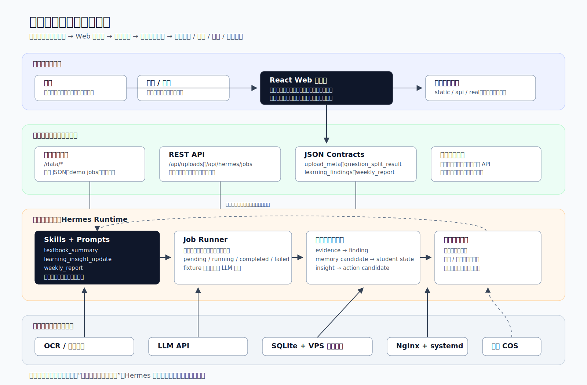
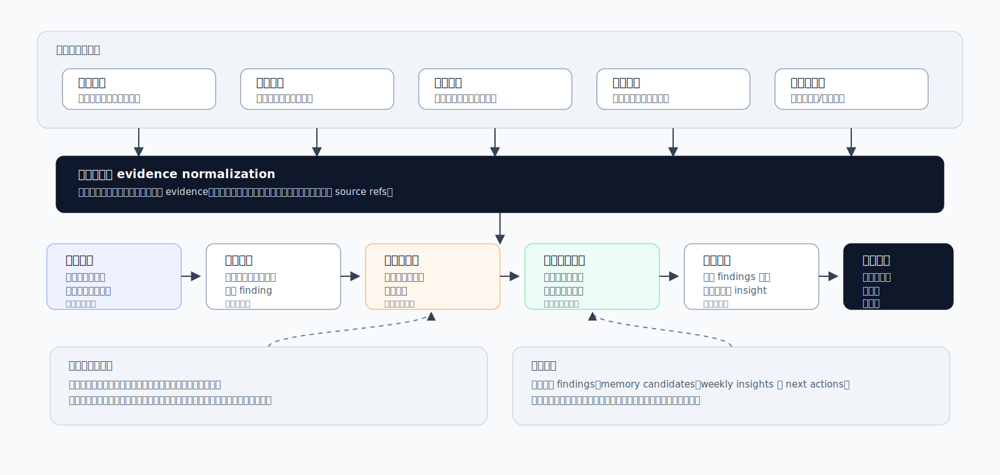
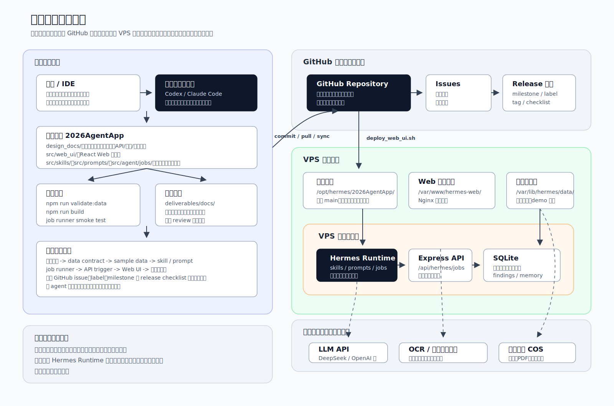

# “学途智伴”AI 学习智能体技术文档

> 项目方向：2026 北京青少年人工智能应用实践活动 - AI 智能体应用  
> 年度主题：我的学习生活小助手  
> 作者信息：待补充  
> 作品链接：待补充  
> 文档版本：技术文档草稿版

## 摘要

“学途智伴”是一个面向中学生学习场景的 AI 学习智能体应用。它要解决的问题不是“再做一个错题本”，也不是做一个只能临时回答问题的聊天机器人，而是帮助学生把课本、试卷、作业、错题、备注等表面学习信息，进一步分析成可追溯的深层问题、学习记忆和下一步行动建议。

本项目的核心思路是：把学生日常产生的学习材料转化为结构化的“学习证据”，再__通过智能体工作流进行分析、关联和总结__。智能体会先识别局部发现，再形成待确定记忆，最后在周报中合并为阶段性见解和少量可执行行动。随着持续使用，系统会通过短期上下文和长期学习记忆__逐步形成对学生学习状态的认知，越来越清楚学生在哪些地方需要帮助__。

在创作方式上，全程采用最新的 AI 工具辅助，通过 vibe coding 的方式完成。在技术实现上，项目采用成熟主流开源技术组件，智能体 skill/prompt/job runner、静态演示与 API 模式可切换架构，并部署到腾讯云 VPS 上。

当前文档重点说明产品设计、智能体工作流、技术架构、核心算法、工具调用逻辑、开发过程和后续演进方向。




## 1. 设计背景：问题和需求

初中学生每天会产生大量学习材料：课本、讲义、试卷、作业、错题本、课堂提醒和临时问题。传统做法通常是把错题抄下来，或者把试卷照片保存在文件夹中。这样可以记录“哪道题错了”，但很难继续回答三个更重要的问题：为什么反复错、背后是哪类理解或方法问题、下一步应该怎么练。

这个问题在多学科场景中更明显。学生自己复习时，容易只盯着题目，不知道应该优先处理哪个薄弱点。家长和老师看到一堆零散材料时，也很难快速理解本周真正的学习重点和风险。普通聊天机器人虽然能解释单道题，但通常只处理当前一轮问答，不能持续整理学习证据，也不能把多次材料合并成阶段性判断。

因此，本项目将“学习生活小助手”理解为一个长期工作的学习智能体。它需要能够接收学习材料，理解材料含义，保留人工确认，持续形成学习记忆，并把分析结果整理成学生、家长和老师都能看懂的建议。

项目的主要用户包括学生、家长和老师。三类用户关注的问题不同，但目标是一致的：让学习材料不再只是堆在文件夹里的记录，而是能转化为可理解、可跟进的学习行动。

- 学生使用系统上传学习材料、确认重点题、补充备注和查看行动建议。目标是更清楚地知道自己下一步该复习什么，而不是只知道“我又错了”。
- 家长查看跨学科周报、薄弱点和跟进方向。目标是用较短时间理解孩子最近的学习状态，知道哪些地方需要陪伴、提醒或和老师沟通。
- 老师可以参考重点题、问题模式和证据来源。目标不是用系统替代教学判断，而是帮助老师更快看到学生反复出现的学习问题。


## 2. 设计理念与核心创新

### 2.1 产品定位

“学途智伴”是基于作者本人在初中学习中遇到的真实问题和需求设计的，目标是做出一个真正了解学生学习状况的 AI 辅导员老师。

“学途智伴”的核心不是错题本，也不是单轮问答机器人。它要构建的是一个学习智能体：把日常学习证据中的表面信息分析成“可追溯发现、学习记忆和下一步行动”。

例如，普通错题记录可能只写“反比例函数薄弱”。本项目希望进一步得到更可解释的问题模式：“遇到反比例函数图像题时，对 k 的正负和象限关系迁移慢。”后者比前者更具体，也更容易生成复习行动。

并且，通过累积使用和记忆，这个 AI 辅导员老师会越来越多地了解学生本人，掌握学生的能力、优势与劣势，帮助制定针对本人的学习计划。

### 2.2 从表面信息到深层问题

本项目最重要的智能体作用，是把表面学习信息继续向深层问题抽象。表面信息可能只是“这道题错了”“这题不会”“这里漏写”。智能体需要结合题目文本、得分、人工备注和教材上下文，分析背后可能是知识点缺口、步骤方法问题、审题问题、表达问题、记忆提取问题，还是学习习惯问题。

这个过程不能凭空下结论。系统必须保留证据来源和不确定性。证据不足时，结果应标注为 unknown 或 uncertain，而不是把一次偶发错误写成长期标签。



### 2.3 学习证据到行动的分层模型

项目采用分层语义模型：

```text
学习证据 evidence
  -> 问题分析 problem analysis
  -> 局部发现 finding
  -> 待确定记忆 memory candidate
  -> 短期记忆 short-term memory
  -> 学生状态认知 student state model
  -> 聚合见解 insight
  -> 长期学习记忆 long-term learning memory
  -> 周报和行动建议
```

其中，evidence 是上传材料、切题结果、人工确认、文字备注和教材摘要。finding 是一次材料或一组证据产生的局部判断。memory candidate 是可能值得保留的问题模式，但需要学生、家长或老师确认。短期记忆保存近期上下文，长期学习记忆保存经过确认或多次证据支持的问题模式、学习习惯和有效帮助方式。

这样设计的好处是，智能体不会每次都像第一次见到这个学生。它可以在持续使用中逐步形成学生状态认知，知道学生最近正在学什么、哪些问题反复出现、哪些行动已经建议过、哪些地方还需要继续支持。

### 2.4 人机协作原则

本项目没有把 AI 设计成完全自动判断学生问题的系统。OCR 和大模型可以辅助处理材料，但学生或家长必须确认重点题和关键语义。这样做有两个原因：一是试卷、手写批注和扣分原因存在识别误差；二是学习问题本身常常需要结合学生真实感受，不能只靠模型猜测。人工确认不是降低智能体能力，而是让智能体的分析更可信。它把“模型可能这样认为”变成“有证据支撑、可以被用户确认或修正”的学习记录。

### 2.5 全链路 AI 协作开发

本项目的另一个创新点，是在开发过程中主动使用 AI 和智能体工具。AI 不替代作者做决定，而是作为协作工具参与规划、设计、开发、部署验证和文档编写。

在规划阶段，AI 辅助拆解竞赛要求、用户需求和版本边界；在设计阶段，辅助整理产品 brief、技术决策、API 设计、存储设计和智能体工作流；在开发阶段，Codex、Claude Code 等编程智能体协助阅读代码、修改实现、发现风险；在部署验证阶段，AI 辅助检查 build、smoke test 和远端同步；在文档阶段，AI 帮助把工程过程整理成技术文档和演示材料。

这体现了“__利用 AI 开发 AI 能力__”的实践方式，也提高了项目完整度。作者仍负责目标判断、范围控制、隐私边界和最终审查。

## 3. 技术选型与智能体方案

### 3.1 技术选型

项目的技术选型服务于两个目标：第一，比赛演示要稳定；第二，架构要能平滑演进到真实 API 和真实 AI 能力。

| 层面 | 选型 | 作用 |
| --- | --- | --- |
| 前端 | Vite + React | 构建学习助手工作台、上传流程、重点题确认、周报查看 |
| 样式 | Tailwind CSS | 快速实现一致的工作台界面 |
| 数据结构 | JSON contract | 约束教材摘要、切题结果、人工确认、学习发现和周报 |
| 智能体能力 | skills + prompts | 把教材摘要、学习洞察更新、周报生成拆成可审查任务 |
| 任务执行 | job runner / job adapter | 表达“提交任务、等待执行、读取结果”的智能体工作流 |
| 执行模式 | static / api / real | 保证演示稳定，同时保留真实 API 和 LLM 接入路径 |
| 后端 | Node.js + Express REST API | 支持上传记录、确认结果、任务状态和结果查询 |
| 持久化 | SQLite | 适合 VPS 上的轻量结构化存储 |
| 部署 | Nginx + systemd + VPS | 成本可控，便于构建、发布和 smoke test |

用 JSON 实现的数据 schema 合约是本项目很重要的工程基础。它让前端、样例数据、job runner 和未来 API 使用同一套结构，避免智能体输出变成无法验证的自由文本。

### 3.2 智能体技术简介

AI 智能体不是“问一句、答一句”的聊天机器人，而是一个围绕目标工作的软件系统。它会读取输入，结合上下文进行分析，必要时调用工具或外部 API，把结果保存为结构化数据，并根据反馈继续改进下一轮行动。

放到本项目中，学习智能体的工作可以概括为三句话：

1. 把学习材料从“零散文件”变成“可分析的学习证据”。
2. 把表面错误从“这道题错了”推进到“背后是什么问题模式”。
3. 通过短期上下文和长期学习记忆，在持续使用中越来越了解学生的状态和需要帮助的地方。

这与普通问答的区别在于：普通问答主要回答当前问题，而智能体工作流围绕长期目标持续推进任务；普通问答通常输出一段文字，而本项目需要输出可展示、可确认、可存储的 findings、memory candidates、weekly insights 和 actions。

### 3.3 主流方案与本项目选择

到 2026 年，人工智能应用正在从“聊天窗口”走向“智能体工作流”。早期的大模型应用主要是用户提问、模型回答；现在越来越多的系统开始具备工具调用、文件处理、长期记忆、任务规划和多步骤执行能力。对普通用户来说，智能体正在进入学习、办公、写作、资料整理、家庭自动化等日常场景。它不再只是一个会说话的模型，而是可以连接文件、网页、数据库、云服务和本地程序，帮助人完成一串任务的软件助手。

目前主流智能体方案包括 OpenAI Agents SDK、LangGraph/LangChain、Microsoft Agent Framework/AutoGen、CrewAI、Dify/Coze 等。它们分别强调工具调用、工作流图、状态持久化、多智能体协作或低代码搭建。对个人助手类应用来说，比较有代表性的方向有两类。

第一类是 LobeChat / LobeHub 这类个人 AI Agent Workspace。它的特点是界面友好、支持多模型服务商、知识库、插件和多模态输入，适合个人快速搭建自己的 AI 助手工作台。它的优势是上手快、交互体验成熟，适合“人和 AI 对话并处理资料”的场景。

第二类是 Hermes Agent 这类可自托管的智能体运行时。它更强调长期运行、工具调用、记忆、技能扩展和自动化任务，可以部署在自己的机器或 VPS 上，适合需要把智能体接入具体工程流程的场景。它不只是前端聊天界面，而更接近一个能持续执行任务的 agent runtime。

本项目选择自建轻量的 Hermes runtime 作为运行时智能体引擎。这里需要区分：产品面向用户时叫“学途智伴学习智能体”，Hermes 是背后的 engine/runtime，负责承载 skill、prompt、job runner、执行模式切换和结果落盘。

选择 Hermes runtime 的原因有三点。第一，它适合部署在 VPS 上，便于和本项目的 Web UI、Express API、SQLite、文件目录和部署脚本放在同一套工程环境中。第二，它可以围绕项目自定义的 JSON contract 工作，保证学习发现、记忆候选和周报不是不可控的自由文本。第三，它能清楚展示智能体的工作过程：从 skill 和 prompt 到 job runner，再到结果校验、存储和前端展示。这比直接使用一个黑盒智能体平台更有利于说明项目的真实实现过程。

## 4. 系统目标与版本边界

项目采用阶段化能力路线：

- 基础闭环演示：证明核心产品路径成立，包括学习内容理解、上传材料、自动切题、人工确认、学习发现、待确定记忆、历史周报和行动建议。
- 真实 AI 和 API：接入 Express REST API、SQLite 持久化和真实 LLM，使 findings、memory candidates、weekly reports 可以动态生成并保存。
- 多用户真实应用：支持账号、角色、权限、对象存储、云数据库、任务队列、审计日志和备份恢复。

这样分阶段是为了控制风险。比赛演示不能被半成品 API 或不稳定 LLM 调用影响，因此 static demo 和 fixture job 可以保证稳定；同时，数据契约、目录结构和执行模式都为真实 API 和生产化保留迁移路径。

## 5. 主要功能设计

### 5.1 学习内容理解

学生可以上传课本、讲义或教材材料，并填写学科、年级、章节范围等信息。智能体生成教材摘要结构，包括章节、学习单元和知识点。这个能力的价值在于，为后续试卷、错题和备注提供参照上下文。

### 5.2 学习成果上传与自动切题

学生在“学习成果”模块上传试卷或作业图片。系统展示题目区域、题目 OCR 文本和切题结果。自动切题可以利用腾讯云 `QuestionSplitOCR` 或同类服务，也可以在演示阶段使用脱敏样例数据。

本项目不宣称自动理解老师全部批改语义。题目是否值得记录、得分情况、错因备注和复习优先级，都由学生或家长人工确认。

### 5.3 人工确认重点题

上传后，学生可以选择哪些题值得记录，并补充得分、满分、知识点、错因、标签和备注。这个步骤把不稳定的 OCR 输出转化为更可信的学习证据，是后续智能体分析的关键输入。

### 5.4 输入文字备注

图片和 OCR 不能覆盖所有学习上下文。学生可以直接输入文字备注，例如“今天反比例函数图像没有听懂”“议论文论据作用不会说明”。备注同样带有学科字段，会进入学习证据集合。

### 5.5 学习洞察更新

当重点题确认保存后，系统触发 `learning_insight_update` job。智能体读取教材摘要、上传材料、人工确认和文字备注，生成局部发现、待确定记忆和行动候选。

局部发现说明这次材料中出现了什么问题；待确定记忆说明哪些问题模式可能值得长期保留；行动候选给出少量具体建议，例如重做题目、复习概念、完成同类变式题或向老师追问。

### 5.6 周报生成与跨学科总结

周报不是每个学科独立生成一份文件，而是对一周内多学科的学习材料进行 consolidation。智能体会读取本周 findings、短期记忆、重点题、备注和教材摘要，形成跨学科总览、各学科摘要、主要风险和下周行动。

周报的价值不在于罗列本周材料，而在于把多个局部发现合并成阶段性问题主线。

### 5.7 智能体执行模式切换

项目支持 `static`、`api` 和 `real` 三类执行模式。`static` 模式读取 `/data/demo_jobs/`，用于稳定演示；`api` 模式调用 `/api/hermes/jobs`，用于真实后端任务；`real` 模式进一步接入真实 LLM。这个设计让项目既能稳定展示，也能逐步迁移到真实系统。

## 6. 技术架构

系统总体上分为 Web 工作台、数据契约、智能体运行时、外部能力和存储部署五部分。

Web 工作台由 Vite + React 实现，主要页面包括学习成果、输入备注、历史周报和学习内容。它负责上传材料、展示切题结果、收集人工确认、显示任务状态和渲染智能体输出。

数据契约使用 JSON contract 管理，核心结构包括 `upload_meta`、`question_split_result`、`question_confirmation_result`、`textbook_content_summary`、`learning_findings`、`weekly_report` 和 `week_reports_index`。这些结构让静态演示数据、未来 API 和智能体输出保持一致。

智能体运行时采用：

```text
Skill -> Prompt -> Job Runner -> Contract Validation -> Storage -> Web UI
```

Skill 定义行为规范，Prompt 定义具体任务模板，Job Runner 是可重复执行的任务入口，Contract Validation 确保结果符合结构要求。三个核心 job 是 `textbook_summary`、`learning_insight_update` 和 `weekly_report`。

存储和部署方面，基础演示可以使用 `src/web_ui/public/data/` 和 VPS `/var/www/html/data/` 提供静态 JSON；真实 API 阶段使用 Express + SQLite + VPS 本地文件；多用户真实应用阶段可以迁移到 COS、PostgreSQL/MySQL、鉴权和签名 URL。

## 7. 核心算法与工作流

### 7.1 证据归一化

系统首先把教材摘要、上传元数据、切题结果、人工确认、文字备注和历史周报统一成 evidence 结构。每条 evidence 都应保留学科、来源、时间、题目、备注、置信度和 source refs。这样后续每个 finding 都能追溯到具体证据。

### 7.2 问题分析

智能体把题目文本、得分、人工备注和教材上下文结合起来，判断问题属于哪个学习单元，以及可能对应哪类问题。分析时不直接把表面错误升级为结论，而是经过中间判断。

例如，表面信息是“反比例函数图像题做错”。系统会结合题目涉及的 k 正负与象限关系、学生备注中的“分不清”，推断深层问题可能是“对参数符号和图像象限之间的规则迁移慢”。对应行动建议是整理 k 正负与象限对应表，并完成 2 道同类变式题。

### 7.3 记忆生成

不是所有 finding 都会进入长期记忆。进入 memory candidate 的条件包括：同类问题重复出现、学生明确标注不理解、属于影响后续学习的基础知识点、老师或家长强调、本周多次出现。单次偶发错误、证据不足或无法确认学科知识点的问题，不应直接进入长期记忆。

### 7.4 周报 consolidation

周报生成时，智能体读取本周 findings、短期记忆、长期学习记忆、重点题、备注和教材摘要。它不会重新判断每道题是否重要，而是把多个局部发现合并成阶段性问题主线，并生成少量下一步行动。

这个过程也是更新学生状态认知的节点。本周证据可以修正、强化或削弱之前的长期学习记忆。

## 8. 工具调用逻辑

当前演示链路主要使用静态 JSON、demo job adapter、JSON contract validation、Vite build 和 Nginx/VPS 静态部署。真实接入阶段可以使用腾讯云 `QuestionSplitOCR`、LLM API、Express REST API、SQLite 和 COS。

上传材料的典型调用顺序是：

```text
用户选择材料
  -> 读取 upload_meta
  -> 读取 question_split_result
  -> 用户确认重点题
  -> 保存 question_confirmation_result
  -> 触发 learning_insight_update
  -> 读取 learning_findings
  -> 展示 findings / memory candidates / actions
```

生成周报的典型调用顺序是：

```text
点击生成周报
  -> 创建 static demo job 或 API job
  -> 状态 pending / running / completed
  -> 读取 weekly_report JSON
  -> 更新报告视图
```

如果 API 不可用，前端可以回退到 static demo；静态演示模式不请求真实 API。任务状态区分 pending、running、completed 和 failed，输入缺失时不生成不可信结果。

## 9. 界面与交互设计

项目第一屏直接进入学习助手工作台，而不是营销首页。打开应用后，应尽快看到可以操作的核心能力，因此页面重点是上传材料、确认重点题、查看学习发现和周报。

主导航包括四个核心视图：学习成果、输入备注、历史周报、学习内容。顶层导航不按学科拆分，学科作为筛选器和内容分区出现。周报采用跨学科总览，帮助学生、家长和老师快速理解整体学习状态。

关键交互包括：上传材料子流程、题目 bbox 叠加展示、重点题编辑表单、保存后分析状态、待确定记忆接受或忽略、周报周期切换，以及执行模式切换器。

## 10. 数据安全、隐私和合规

本项目遵守比赛对隐私和安全的要求。公开仓库不提交真实学生数据、真实试卷图片、API key、私人讨论和原始日志。示例数据必须脱敏，真实运行数据应保存在内部目录或未来的私有对象存储中。

项目区分内部数据和公开演示数据：

```text
内部数据：/var/lib/hermes/data/
公开 demo：/var/www/html/data/
仓库 public demo：src/web_ui/public/data/
```

模型输出也有安全边界。系统不替代老师诊断，不输出高风险教育结论，不把单次 finding 自动变成长期标签。证据不足时，输出应标注不确定。

## 11. 测试、验证和部署

项目的开发和部署不是只在一台电脑上完成，而是分成本地开发环境、GitHub 协作仓库、VPS 运行环境和外部云服务四部分。作者在本地使用 IDE、浏览器、Node.js、Vite、Codex/Claude Code 等工具进行设计、编码和验证；代码通过 GitHub 保存版本、管理 issue、同步多台电脑和多智能体的开发结果；VPS 负责运行正式展示环境，包括 Nginx、Web UI、静态数据目录、后端 API、job runner 和智能体运行时。



在这个架构中，本地智能体主要帮助作者完成代码阅读、修改、测试和文档整理；VPS 上的智能体更接近运行时能力，负责执行学习洞察、周报生成等任务。真实能力接入时，VPS 会调用外部云服务，例如 LLM API、OCR/图像切题服务和对象存储。这样设计的好处是：开发过程可以快速迭代，正式环境可以稳定运行，外部 AI 和云服务也可以逐步替换或增强，而不影响已有的演示闭环。

本地验证主要包括数据校验和前端构建：

```bash
cd src/web_ui
npm run validate:data
npm run build
```

Job runner 可以通过 smoke test 验证：

```bash
bash src/agent/jobs/smoke_test_jobs.sh
```

VPS 部署采用源码目录和发布目录分离：

```text
/opt/hermes/2026AgentApp/
/var/www/hermes-web/
/var/www/html/data/
```

部署脚本为：

```bash
bash scripts/deploy_web_ui.sh
```

版本管理方面，项目使用 GitHub issue、label、milestone、release checklist 和 release tag 管理范围。这样可以避免多电脑、多 agent 并行开发时出现功能越界或半成品进入正式发布。

## 12. 应用价值与创新亮点

本应用可以为使用者带来非常直接的价值：

- 对学生来说，系统能把零散材料整理成可复习行动，减少“不知道从哪里复习”的问题，并帮助形成学习反思。更重要的是，智能体会随着持续使用逐步了解学生的薄弱点、学习习惯和需要帮助的方式。
- 对家长和老师来说，系统能快速展示本周学习情况、证据来源、具体问题模式和行动建议，而不只是显示分数。它也能帮助家长看到学生状态如何随时间变化，哪些问题正在改善，哪些问题需要继续支持。

技术创新主要体现在四点。
- 第一，采用 evidence -> finding -> memory -> student state -> insight -> action 的分层语义模型。
- 第二，用 task-specific skills 和 JSON contract 约束智能体输出。
- 第三，通过 static/api/real 模式切换，同时保证比赛演示稳定和真实 API 迁移。
- 第四，在开发过程中全链路使用 AI 和智能体工具，把规划、设计、编码、部署验证和文档编写都放进可以检查和复盘的工程流程。

开发过程中，作者不断向老师和有经验的开发者请教，也用 AI 工具帮助梳理思路。项目先把“学习助手”拆成多个可演示工作流：学习内容理解、学习成果上传、人工确认、文字备注、学习洞察更新和周报生成。开发过程采用设计先行。产品简报、技术决策、API/存储设计和 JSON contract 先确定边界，再进入实现。实现完成后，通过 demo data 校验、前端 build、job runner smoke test 和 VPS 部署检查保证结果可运行。

AI 和智能体也贯穿开发全过程。作者使用 AI 辅助梳理需求、竞赛规则和设计文档，使用编程智能体协助实现前端、后端、数据契约和部署脚本，并通过人工审查、版本计划和 GitHub issue 控制范围。这个过程也体现了 OPC（One Person Company，单人公司）这类新概念背后的变化：一个中学生不可能一个人精通所有技术，但可以借助 AI 把想法、代码、测试、部署和文档一步步串起来。AI 提高了效率，但最后的目标、取舍和检查仍然要由人负责。

## 13. 总结与感悟

### 13.1 感悟与收获
这个项目最开始不是从技术出发，而是从我自己的学习问题出发。进入初中以后，学习内容变多，压力也变大。我花了不少时间刷题，但成绩提升并不明显。后来老师提醒我，刷题本身不是目的，更重要的是弄清楚自己到底卡在哪里。那时我发现，很多错题记录只是写下“哪道题错了”，没有继续想“为什么错”和“下次怎么避免”。

所以我做“学途智伴”，其实也是想做一个自己真的会用的工具。它不是替我学习，而是帮我把零散材料整理清楚，把表面错误继续分析成更具体的问题，再提醒我下一步该做什么。

做这个项目的过程也让我学到很多原来只听说过的东西：前端页面、数据结构、API、数据库、VPS 部署、GitHub issue、版本管理，还有智能体的 prompt、skill 和 job runner。最开始这些词都很陌生，但把它们放到一个真实项目里之后，就能理解它们各自解决什么问题。

我最大的收获是，AI 工具不是简单给答案的工具，而是可以一起做项目的协作工具。它能帮我查漏补缺、生成方案、修改代码和整理文档，但我必须判断哪些建议是对的，哪些功能应该放进当前版本，哪些内容涉及隐私或不该公开。这让我更清楚地体会到，使用 AI 不是少思考，而是要学会提出问题、拆解任务和做最后判断。


### 13.2 不足与改进方向

当前系统仍有继续改进空间。在线生成质量、成本控制和失败重试需要继续增强；OCR、文件上传和异常处理还可以进一步生产化；多用户、权限和数据隔离应作为真实场景应用阶段重点；记忆系统也需要更多真实数据积累，才能验证学生状态认知和长期跟踪效果。

下一步计划是先完善真实 AI/API 能力：接入 Express API、SQLite 持久化和 LLM 动态生成，保存用户确认和记忆决策。再向多用户真实应用演进：引入账号角色、COS、PostgreSQL/MySQL、任务队列、审计、备份和监控。

对于我本人来说，现有的开发工作过分依赖AI的自主代码生成能力，有些技术用到了但是我自己还是不够深入了解。接下来会继续深入学习相关软件技术知识，做到真正熟练掌握。

## 参考资料

- OpenAI Agents SDK：https://openai.github.io/openai-agents-python/
- Anthropic《Building effective agents》：https://www.anthropic.com/engineering/building-effective-agents
- LobeChat / LobeHub：https://github.com/lobehub/lobe-chat
- Hermes Agent Docs：https://hermes-agent.nousresearch.com/docs/
- 腾讯云 OCR：https://www.tencentcloud.com/zh/products/ocr
- 腾讯云通用文字识别 API：https://www.tencentcloud.com/document/api/1005/37315/
- 腾讯云对象存储 COS：https://cloud.tencent.com/product/cos
