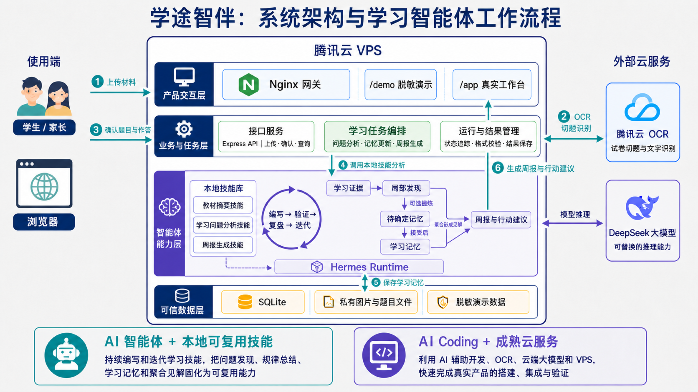

# “学途智伴”AI 学习智能体技术文档

> 项目方向：2026 北京青少年人工智能应用实践活动 - AI 智能体应用  
> 年度主题：我的学习生活小助手  
> 作者信息：待补充  
> 作品链接：待补充  
> 文档版本：V2 设计核查版（2026-09-02）

## 摘要

“学途智伴”是一个面向初中生错题复盘场景的 AI 学习智能体。它不只是保存错题，也不只是回答一道题，而是把练习图片转化为可追溯的学习证据，帮助学生发现局部问题、选择值得保留的学习记忆，并生成周报与下一步行动建议。

V2 的真实产品闭环是：导入练习图片，调用腾讯云 OCR 切分题目，学生确认其中的错题，Hermes 智能体调用本地 Skill 分析每道确认错题，形成局部发现和可选的待确定记忆；学生接受或忽略记忆候选后，系统再把本周发现、对应证据和必要的已接受历史记忆聚合为周报与行动建议。教材知识图谱由离线 Skill 预先生成并独立管理，用来提供教材结构参照，不与学生学习记忆混合。

系统采用 React、Express、SQLite、Hermes Agent、本地 Skills、腾讯云 OCR 和外部大模型服务构建。核心产品数据以 SQLite 为唯一权威来源；原始图片保存在私有目录；外部服务只承担 OCR 或模型推理。V2 已完成 E1–E5 的实现与验收，真实 OCR、真实 Hermes 分析、记忆决策和周报链路已有代表性证据；E6 正式部署与最终运行验证尚未完成，因此本文不会把规划中的部署结果写成现状。

项目的方法论可以概括为两点：一是利用 AI 智能体和持续迭代的 Skill，把“发现学习问题、总结、记忆和生成见解”固化为可重复能力；二是尽量利用 AI coding 和现成云服务，在个人可承担的范围内快速搭建并验证完整产品闭环。

## 1. 设计背景：问题和需求

初中生每天会产生大量试卷、作业和错题材料。传统错题本可以记录“哪道题错了”，却很难继续回答“这次错误反映了什么局部问题”“哪些问题值得以后提醒自己”“下周应该采取什么行动”。材料越多，单纯保存图片或抄题越容易变成新的信息负担。

普通聊天机器人可以解释一道题，但一次回答通常不会自然形成可追溯的学习记录，也不会区分当次观察、可能原因和已被学生认可的长期记忆。直接让模型给学生贴标签还可能把一次偶发错误夸大成稳定弱点。

因此，V2 把主要用户收敛为学生本人，把主要场景收敛为“数学练习图片的错题复盘”。家长或老师可以阅读学生展示的周报，但当前版本没有实现多角色账号、权限管理或班级管理。系统的目标不是代替老师诊断，而是帮助学生把零散证据整理成可检查、可选择、可行动的学习反馈。

## 2. 总体立意与设计原则

### 2.1 从错题记录走向学习证据链

“学途智伴”的核心产物不是一句模型回答，而是一条能够回看来源的产品证据链：

```text
练习图片
  -> OCR 题目与作答信息
  -> 学生确认的错题
  -> 局部发现
  -> 可选的待确定记忆
  -> 经学生接受的学习记忆
  -> 周报与行动建议
```

“局部发现”是针对一次确认错题的分析结果；“待确定记忆”是其中可能值得跨时间保留的模式，必须由学生决定是否接受；“学习记忆”只指已经接受的记忆；“聚合见解”不是一种长期存储对象，而是生成周报时对多条本周发现及其证据进行归纳的过程。

### 2.2 观察和推测分开表达

智能体分析必须区分两类信息：一类是题目、作答和确认结果中能够直接观察到的事实；另一类是对错误原因的解释性推测。证据不足时，应明确写成“原因尚不明确”，不能为了让报告显得完整而强行归因。

每条局部发现都保留来源关系，使用户可以回到具体题目检查判断。当前证据与历史记忆不一致时，以当前证据为准，历史记忆只能作为辅助背景。

### 2.3 教材知识和学生记忆分离

教材知识图谱描述“教材本身有什么章节、知识点和关系”，学生学习记忆描述“学生已经确认要保留的个人学习模式”。两者用途和权威来源不同，不能混在同一套记忆中。

V2 当前只使用经审查的“人教版八年级下册数学”知识图谱，包含 5 章、13 节、32 个知识点。它由离线 `textbook-knowledge-map` Skill 生成和校验，供错题分析引用；学生的发现、记忆和周报则保存在产品数据库中。

### 2.4 人在闭环中的位置

学生确认错题，是为了把可能有误的 OCR 结果转化为明确的分析输入；学生接受或忽略记忆候选，是为了控制哪些推测可以在以后被复用。人工确认位于流程中心，但它不是产品的视觉焦点，也不是智能体价值本身。真正的核心价值是：Skill 能够把确认后的证据稳定地转化为局部发现、可选择的记忆和行动建议。

### 2.5 用 AI 构建 AI 能力

项目采用 AI coding 辅助需求拆解、前后端实现、测试、部署准备和文档整理，并优先复用成熟的 OCR、大模型、VPS 和开源软件能力。作者负责产品目标、范围、隐私边界和最终审查。

Hermes Skill 的编写与迭代是项目的重要技术资产。Skill 把输入约束、分析步骤、输出结构和失败要求固化在本地；底层大模型是可替换的外部推理服务。这样，系统能力不只依赖某一次临时提示词，也不把产品逻辑交给外部模型自由决定。

## 3. 技术选型与智能体方案

### 3.1 当前技术栈

| 层面 | 当前选型 | 在 V2 中的作用 |
| --- | --- | --- |
| Web 前端 | React + Vite + Tailwind CSS | 导入练习、确认错题、查看分析、处理记忆、生成周报 |
| 页面路由 | React Router | 提供 `/app/overview`、`/app/import`、`/app/analysis`、`/app/report` |
| 后端 | Node.js + Express REST API | 接收上传、管理 OCR 和 Hermes 任务、提供发现/记忆/报告接口 |
| 产品数据 | SQLite | 保存上传记录、题目、确认、任务、发现、记忆决策和周报 |
| 私有文件 | VPS/本地私有目录 | 保存原始练习图片，不由 Web 静态目录公开提供 |
| OCR | 腾讯云 QuestionSplitOCR | 切分题目并返回题目、作答和位置数据 |
| 智能体运行时 | Hermes Agent CLI | 以非交互子进程执行本地 Skill，并返回结构化结果 |
| 智能体能力 | 本地 Hermes Skills | 固化教材图谱、错题分析和周报生成能力 |
| 模型推理 | Hermes 配置的外部大模型 | 提供语言理解和生成能力；当前验证使用 DeepSeek |
| 结果约束 | JSON contract + 语义校验 | 检查结构、枚举、引用关系和关键业务约束 |
| 部署目标 | Nginx + systemd + VPS | E6 的正式部署目标，当前不作为已完成结果表述 |

### 3.2 三个核心 Skill

| Skill | 运行位置 | 主要输入 | 主要输出 |
| --- | --- | --- | --- |
| `textbook-knowledge-map` | 离线开发流程 | 教材材料和结构要求 | 经校验的教材知识图谱 |
| `confirmed-mistake-analysis` | 在线产品流程 | 确认错题、OCR 证据、教材上下文、必要的已接受记忆 | 每题一条主要局部发现、可选记忆候选、行动候选 |
| `weekly-learning-report` | 在线产品流程 | 本周发现及对应证据、必要的已接受历史记忆 | 周报摘要、聚合见解和少量行动建议 |

三个 Skill 不是把同一段提示词换名字。它们分别有不同的输入边界、输出合约和失败条件，并在 E3–E5 中持续迭代。在线产品流程不会直接调用 DeepSeek API，而是由 Express 后端调用本地 Hermes CLI，再由 Hermes 按配置访问模型服务。

### 3.3 为什么选择本地 Skill 与轻量运行时

本项目不是为了展示一个通用智能体平台，而是要证明一个具体学习闭环。使用本地 Skill 有三点好处：

- 产品规则可以随代码版本保存、审查和复现；
- 更换底层模型时，输入输出边界和产品数据结构仍然稳定；
- Hermes 失败、超时或输出不合格时，后端可以明确终止任务，不写入部分业务结果。

SQLite 负责产品记忆的持久化，Hermes 自身的环境记忆不作为产品权威数据源。这一区分避免了“模型似乎记得”与“产品确实保存了”之间的混淆。

## 4. V2 范围与当前进展

### 4.1 当前交付状态

| 阶段 | 交付内容 | 状态 |
| --- | --- | --- |
| E1 | Express API、SQLite、基础持久化和任务框架 | 已完成并验收 |
| E2 | 真实 Web 应用入口和 API 闭环 | 已完成并验收 |
| E3 | 离线教材知识图谱与审查流程 | 已完成并验收 |
| E4 | 练习图片上传、腾讯云 OCR、题目叠加与错题确认 | 已完成并验收 |
| E5 | 真实 Hermes 错题分析、记忆决策、周报与代表性学习故事 | 已完成并验收 |
| E6 | 正式 VPS 部署、运行验证、恢复与最终交付核查 | 尚未完成 |

### 4.2 双入口边界

`/demo` 是冻结的静态演示入口，只读取公开样例数据，不调用 API、OCR 或 Hermes。它用于稳定展示早期产品概念。

`/app` 是 V2 真实产品入口，浏览器通过 REST API 访问 Express 后端，后端使用 SQLite、私有文件、腾讯云 OCR 和 Hermes。两个入口相互隔离；真实能力失败时，`/app` 不会悄悄回退到静态结果。

### 4.3 当前受控范围

V2 为竞赛验证主动限制范围：

- 单一演示学生上下文，尚无账号和多用户隔离；
- 学科聚焦数学，教材聚焦人教版八年级下册；
- 每次上传 1 张 JPG/PNG 图片，大小不超过 7 MiB；
- 学生从 OCR 结果中选择最多 10 道错题进入一次分析；
- 一道确认错题生成一条主要局部发现，避免重复堆叠结论；
- 一份周报聚焦当前演示学生和数学场景，保留最近一次成功结果；
- 不实现记忆编辑、合并、自动去重、自动长期画像或跨学科趋势判断。

这些限制不是最终产品设想，而是为了让 V2 的每个结论都有可以验证的输入、输出和失败边界。

## 5. 主要功能设计

### 5.1 离线教材知识图谱

开发阶段通过 `textbook-knowledge-map` Skill 把指定教材整理为章节、单元和知识点图谱，再经过 schema 校验、内容审查和版本登记后进入产品。V2 不支持学生在线上传任意教材并即时生成图谱。

### 5.2 练习图片导入与 OCR

学生在 `/app/import` 上传一张练习或试卷图片。后端先校验文件类型和 7 MiB 大小上限，再保存到私有上传目录并创建 OCR 任务。腾讯云 QuestionSplitOCR 返回题目区域、文字和作答信息，前端把题目框叠加在原图上，便于学生检查切分是否正确。

OCR 只负责“看见并切分”，不负责判断哪道题是学生真正需要复盘的错题。外部 OCR 调用失败时，任务标记为失败，不生成伪造题目，也不暴露原始供应商响应。

### 5.3 错题确认

学生查看 OCR 结果后，选择需要复盘的题目并保存确认。这个步骤建立“用户确实要分析这些题”的业务事实，也是后续 Hermes 任务的输入边界。确认记录与题目、上传和 OCR 任务建立引用关系。

### 5.4 错题分析与局部发现

确认完成后，前端触发 `confirmed_mistake_analysis` 任务。后端组装确认题目、OCR 证据、教材上下文和必要的已接受历史记忆，通过标准输入交给 Hermes CLI。

Skill 对每道确认错题生成一条主要局部发现，区分可观察错误和推测原因，并提供证据引用、置信信息、可选的记忆候选和可执行行动。结果通过结构与业务语义校验后，才在同一数据库事务中落盘。

### 5.5 记忆决策

学生可以接受或忽略待确定记忆。只有接受后的内容才成为学习记忆，并可在未来任务中作为辅助历史背景。忽略的候选不会被后续分析复用。

V2 不自动把所有发现升级为记忆，也不因多次出现就自动合并或修改历史记忆。记忆决策权保持在学生手中，当前证据始终优先于历史概括。

### 5.6 周报与行动建议

学生在 `/app/report` 手动触发 `weekly_learning_report`。系统读取本周局部发现、每条发现对应的题目证据，以及确有必要的已接受历史记忆。Skill 在一次任务内部完成聚合，生成阶段性见解、周报摘要和少量行动建议。

周报不会反向修改局部发现，不会产生新的记忆候选，也不会自动改写已接受记忆。“聚合见解”是周报生成中的转换动作，而不是和局部发现并列的持久化层。

### 5.7 可见失败和重新执行

OCR 和 Hermes 都是可能失败的外部能力。界面显示排队、运行、成功、失败或中断状态，并允许用户在修正条件后重新执行。失败任务不能写入部分发现、部分记忆或半份周报；真实入口也不能用静态样例掩盖失败。

## 6. 系统架构与功能流程



*图 6-1 学途智伴系统架构与学习智能体工作流程*

图 6-1 把系统架构与业务流程放在同一张图中，按照四层组织：

- **产品交互层**：浏览器中的真实 Web 应用，承载导入、确认、分析、记忆决策和周报查看。
- **业务与任务层**：Express API 负责上传/OCR、错题确认、Hermes 分析和周报任务，控制任务状态与事务边界。
- **智能体能力层**：Hermes Agent 调用本地 Skills，完成局部发现生成、学习记忆候选生成和周报聚合；底层大模型位于系统外部。
- **可信数据层**：SQLite 保存产品结构化事实，私有文件目录保存原始图片，教材知识图谱独立提供知识参照。

腾讯云 OCR 和大模型是外部云服务。它们可以处理经过控制的输入并返回结果，但不直接拥有产品数据库写权限。后端必须先校验外部结果，再决定是否写入业务数据。

图中的主流程为：

```text
学习证据
  -> 局部发现
  -> 待确定记忆
  -> 学习记忆
  -> 周报生成时聚合见解
  -> 周报与行动建议
```

“待确定记忆”可以被忽略，因此不是每条局部发现都会进入学习记忆；周报既使用本周发现，也可以使用必要的已接受历史记忆。第 6 步“生成周报”从智能体能力层发起，由 `weekly-learning-report` Skill 完成，而不是由数据库自行生成。

结构校验用于检查 JSON 是否满足字段、类型、枚举和引用格式；语义校验进一步检查“每道确认错题是否恰有一条主要发现”“证据引用是否存在”“未接受记忆是否被错误复用”等业务规则。校验能阻止格式错误或违反明确规则的结果进入数据库，但不能单独证明模型分析在教育意义上一定正确。

## 7. 数据模型与智能体工作流

### 7.1 主要数据对象

| 数据对象 | 含义 | 权威来源 |
| --- | --- | --- |
| upload / ocr job | 上传文件及 OCR 执行记录 | Express + SQLite / 私有文件 |
| question | OCR 切分出的题目、作答和位置 | 腾讯云结果经后端校验后落库 |
| confirmation | 学生选择进入分析的错题 | 学生操作 + SQLite |
| learning finding | 对一条确认错题的局部分析 | Hermes Skill 结果经校验后落库 |
| pending memory | 可由学生接受或忽略的记忆候选 | Hermes Skill 结果经校验后落库 |
| memory decision | 接受或忽略决定 | 学生操作 + SQLite |
| accepted memory | 可供后续任务读取的学习记忆 | SQLite 中已接受的记忆决策 |
| action candidate | 针对发现或周报的行动建议 | Hermes Skill 结果经校验后落库 |
| weekly report | 对本周发现和证据的聚合结果 | Hermes Skill 结果经校验后落库 |
| knowledge map | 教材章节和知识点结构 | 离线生成、审查并登记的 JSON |

### 7.2 错题分析输入组装

后端以数据库中的确认记录为起点，只读取与本次任务有关的题目和证据。需要历史背景时，只选择已经接受且与当前主题相关的学习记忆。组装后的输入通过标准输入传给非交互 Hermes 子进程，任务 ID、超时和执行日志由后端管理。

Skill 要求先描述直接观察到的错误，再谨慎提出可能原因。当证据无法支持原因判断时，保留“原因尚不明确”。这项要求已经在 E5 的代表性两批数据中验证：出现无法可靠归因的样例时，结果没有被强制包装成趋势结论。

### 7.3 记忆复用规则

记忆复用遵循三条规则：

- 只有已接受记忆可以进入后续任务上下文；
- 历史记忆只能辅助解释，不能覆盖当前题目证据；
- 周报可以引用必要的历史记忆，但本周发现无需先被接受为记忆，仍然可以进入当周周报。

这使“发现”和“记忆”承担不同职责：发现忠实记录当次分析，记忆代表学生愿意跨时间保留的概括。

### 7.4 周报内部聚合

周报任务以当前周的发现和相应证据为主输入，在同一次 Skill 执行中完成归类、比较和行动生成。V2 没有单独的“聚合见解数据库层”，也没有后台自动 consolidation 任务。这样可以减少不必要的状态和中间对象，使报告结果更容易追溯。

## 8. API 与工具调用逻辑

真实产品入口的主要调用顺序如下：

```text
POST 上传图片
  -> 创建并执行 OCR 任务
  -> GET 查询 OCR 状态与题目结果
  -> 保存错题确认
  -> POST /api/hermes/jobs 创建 confirmed_mistake_analysis
  -> GET 查询任务状态和结果
  -> GET /api/findings 展示局部发现
  -> POST 记忆接受或忽略决定
  -> POST /api/hermes/jobs 创建 weekly_learning_report
  -> GET /api/reports 展示最新成功周报
```

HermesBridge 以本地非交互子进程执行 Hermes CLI：

```text
Express 组装结构化输入
  -> JSON 写入 Hermes 标准输入
  -> Hermes 加载本地 Skill
  -> Hermes 调用外部大模型
  -> JSON 写入标准输出，诊断写入标准错误
  -> 后端检查退出码、超时、结构和业务语义
  -> 成功后由 SQLite 事务写入产品数据
```

生产逻辑使用 `HERMES_JOB_MODE=real`。`HERMES_E5_TEST_MODE=fixture` 只允许在自动化测试中使用，不是产品失败后的回退通道。早期 E1 的 `learning_insight_update` 和 `weekly_report` 名称只保留兼容用途，V2 产品任务名称分别是 `confirmed_mistake_analysis` 和 `weekly_learning_report`。

## 9. 界面与交互设计

V2 真实应用包含四个页面：

| 页面 | 主要作用 |
| --- | --- |
| `/app/overview` | 展示当前流程状态和进入各任务的入口 |
| `/app/import` | 上传图片、查看 OCR 题目框并确认错题 |
| `/app/analysis` | 查看局部发现、行动候选并处理记忆候选 |
| `/app/report` | 手动生成并查看最新成功周报 |

页面顺序遵循业务进度，而不是把所有 AI 输出堆在同一屏。界面不提供 `static/api/real` 模式切换器；用户通过 `/demo` 或 `/app` 进入不同边界明确的应用。真实任务状态在界面中可见，错误信息说明下一步可以重试或返回修正输入。

当前交互重点是完成一条受控闭环，因此没有实现自由文本备注页、任意学科筛选、多学生切换、记忆编辑器或自动运行周报。

## 10. 数据安全、隐私和可信边界

公开演示数据与真实运行数据严格分开。`src/web_ui/public/data/` 只保存脱敏的公开样例；真实练习图片默认保存到 `runtime/private/uploads/`，也可通过 `HERMES_PRIVATE_UPLOADS_DIR` 配置到部署环境的私有目录。产品结构化数据默认保存在 API 服务的 SQLite 数据库中，也可通过 `DATABASE_URL` 配置。

API key、数据库配置和供应商凭据通过环境变量提供，不写入 Git 仓库。公开文档和测试证据不得包含真实学生姓名、真实私人试卷、原始 OCR 供应商响应或密钥内容。

当前 V2 是单学生受控验证系统，尚未实现账号鉴权、多用户数据隔离、细粒度授权、审计后台和完整备份恢复，因此不能作为面向公众的生产级教育平台。E6 需要继续验证 HTTPS、进程守护、私有文件访问、环境变量、重启恢复和部署回滚。

## 11. 测试、证据与部署状态

### 11.1 本地验证入口

后端与真实链路的主要验证命令：

```bash
cd src/api
npm ci
node scripts/smoke_api.mjs
npm run validate:knowledge-map
npm run smoke:knowledge-map
npm run smoke:e4
npm run smoke:e5
```

前端数据与构建验证：

```bash
cd src/web_ui
npm ci
npm run validate:data
npm run build
```

真实 OCR 和真实 Hermes 验证还需要由私有环境变量提供云服务凭据。fixture 测试用于验证代码路径和数据合约，不能替代真实供应商调用证据。

### 11.2 当前代表性产品证据

截至 2026-09-02，E1–E5 已通过各自 Final Gate 并合入主线。现有代表性证据包括：

- 浏览器真实入口能够完成图片上传、OCR 切题框展示和错题确认；
- E4 已保存真实腾讯云 QuestionSplitOCR 调用及题目框叠加验证证据；
- E5 已保存两批受控练习数据的真实 Hermes/大模型分析结果；
- 学生接受的记忆能够在后续分析和周报中被受控复用；
- 周报通过真实 `weekly-learning-report` Skill 生成，并保留“原因尚不明确”的证据边界；
- SQLite 中可追溯上传、确认、任务、发现、记忆决策和报告之间的关系。

这些证据证明了 V2 受控闭环可以运行，但不能推出系统已经在任意教材、任意学生和任意题型上达到稳定教育判断质量。

### 11.3 部署状态

VPS 拓扑和部署脚本已经设计，目标是由 Nginx 提供 Web 入口、systemd 守护 Express 服务，应用在私有目录保存 SQLite 和上传图片，并通过外部网络调用腾讯云 OCR 与大模型服务。

E6 仍处于待完成状态。正式域名/HTTPS、真实环境连续运行、进程重启恢复、备份与回滚、最终作品链接和跨环境复现应在 E6 完成后补充实证。本文因此不宣称“最终 VPS 产品已经完成部署”。

## 12. 应用价值与创新亮点

### 12.1 对学生的价值

系统把“保存一张错题图片”推进为“知道这次出现了什么问题、哪些概括值得记住、接下来做什么”。局部发现保留题目来源，学生可以核查；记忆候选由学生决定；周报只给出少量具体行动，降低复盘负担。

### 12.2 技术与方法创新

- **真实产品证据链**：从图片、OCR、确认、发现、记忆到周报都有结构化记录和引用关系，而不是只展示一段模型回答。
- **Skill 固化智能体能力**：教材图谱、错题分析和周报生成分别由可版本化、可测试、可迭代的本地 Skill 承载，底层模型可以替换。
- **发现与记忆分离**：当次发现不等于长期标签；只有学生接受的记忆才可被以后复用。
- **结构与语义双重校验**：外部模型结果只有通过合约和明确业务规则后才能进入 SQLite。
- **真实入口与静态演示隔离**：`/app` 的失败不会被 `/demo` 样例掩盖，便于清楚说明什么是真实能力。
- **AI coding 与现成云服务组合**：用编程智能体加速实现，用 OCR、模型和 VPS 承担成熟基础能力，把有限精力集中到学习工作流和 Skill 迭代。

项目的价值不在于宣称 AI 已经“完全了解学生”，而在于建立一种更可信的积累方式：每次只从具体证据形成局部发现，让学生选择可保留的记忆，再在周报中谨慎聚合。

## 13. 总结、收获与后续计划

### 13.1 项目收获

这个项目来自真实学习中的困惑：刷题和保存错题并不自动带来有效复盘，关键是弄清楚自己在什么地方卡住，以及下一步该采取什么行动。通过构建“学途智伴”，作者把前端、API、数据库、OCR、智能体 Skill、外部大模型和 VPS 部署准备连接成一个完整工程，并学习了如何用 GitHub issue 和阶段验收控制范围。

更重要的收获是认识到：AI 工具可以参与规划、编码、测试和文档，但不能替代作者判断目标、证据和边界。模型可能生成看似合理的解释，系统仍然需要保留不确定性、让用户决定记忆，并用真实产品数据检查链路。

### 13.2 当前不足

V2 的证据范围仍然有限：

- 教材和学科只覆盖人教版八年级下册数学；
- E5 的质量证据来自小规模、受控的两批练习材料，不代表普遍准确率；
- 当前周报查询固定在演示学生和数学场景，尚无多用户和跨学科能力；
- 没有长期行动反馈、自动趋势验证、记忆编辑合并或学生能力画像；
- OCR 和大模型仍受网络、配额、费用和供应商质量影响；
- E6 正式部署、恢复与最终交付验证尚未完成。

### 13.3 下一步计划

近期优先完成 E6：部署真实 `/app`、配置 HTTPS 与服务守护、保护私有数据、完成连续运行和重启恢复验证，并把最终作品链接和可复现证据补充到交付材料中。

V3 方向应在更多真实且获授权的数据上验证后再决定，可能包括多用户隔离、更多教材、行动完成反馈、记忆维护和成本监控。任何扩展都不应绕过 V2 已建立的证据引用、用户记忆决策和失败不落部分结果原则。

## 参考资料

- 项目 V2 总览：`docs/v2/README.md`
- 项目 V2 架构：`docs/v2/architecture.md`
- Hermes 运行时与 Skills：`docs/v2/hermes-runtime-and-skills.md`
- E5 设计：`docs/v2/epics/e5-hermes-learning-analysis.md`
- E5 实现映射：`docs/v2/epics/e5-implementation-map.md`
- E5 真实集成证据：`docs/v2/epics/e5-vps-real-integration-evidence.md`
- Hermes Agent Docs：https://hermes-agent.nousresearch.com/docs/
- 腾讯云 OCR：https://www.tencentcloud.com/zh/products/ocr
- 腾讯云 QuestionSplitOCR API：https://cloud.tencent.com/document/product/866/33526
- React：https://react.dev/
- Express：https://expressjs.com/
- SQLite：https://www.sqlite.org/
